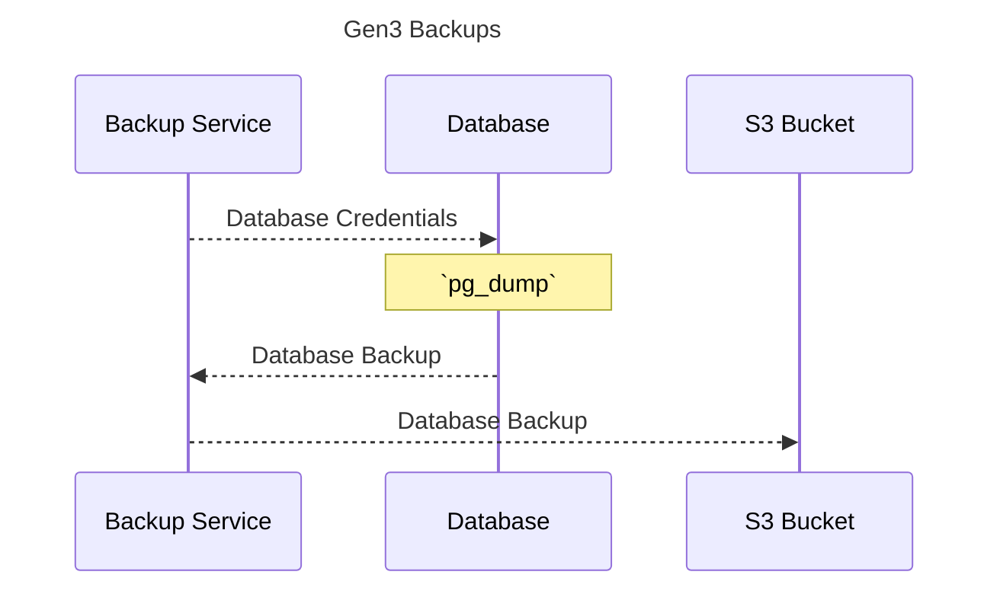

[![License: Apache 2.0][license-badge]][license]
[![GitHub Release][release-badge]][release]
[![Tests][tests-badge]][tests]
[![Docker][docker-badge]][docker]
[![Helm][helm-badge]][helm]

[license-badge]: https://img.shields.io/badge/License-Apache-blue.svg
[license]: https://opensource.org/license/apache-2-0

[release-badge]: https://img.shields.io/github/v/release/ACED-IDP/backup-service
[release]: https://github.com/ACED-IDP/backup-service/releases

[tests-badge]: https://img.shields.io/github/actions/workflow/status/aced-idp/backup-service/tests.yaml?label=tests
[tests]: https://github.com/ACED-IDP/backup-service/actions/workflows/tests.yaml

[docker-badge]: https://img.shields.io/badge/Docker%20Repo-Quay.io-blue?logo=docker
[docker]: https://quay.io/repository/ohsu-comp-bio/backup-service?tab=tags&tag=latest

[helm-badge]: https://img.shields.io/badge/Helm-0F1689?logo=helm&logoColor=fff
[helm]: https://github.com/ohsu-comp-bio/helm-charts/tree/main/charts/backups

# 1. Overview ⚙️

Data backup and recovery service for the CALYPR systems 🔄

# 2. Quick Start ⚡

> [!TIP]
> The recommended use of the backup-service is through deploying to a K8s cluster for automated daily backups. 

```sh
➜ helm repo add ohsu https://ohsu-comp-bio.github.io/helm-charts

➜ helm upgrade --install backups ohsu/backups
```

# 3. CLI

> [!TIP]
> Manual backups (and restorations) can be done through the CLI

```sh
➜ git clone git@github.com:calypr/backup-service.git
Cloning into 'backup-service'...

➜ cd backup-service

➜ python3 -m venv venv && source venv/bin/activate

➜ pip install -r requirements.txt

➜ pip install -e .

➜ bak --help
Usage: bak [OPTIONS] COMMAND [ARGS]...

Options:
  --version               Show the version and exit.
  -v, --verbose, --debug  Enable verbose (DEBUG) logging.
  --help                  Show this message and exit.

Commands:
  backup    Postgres ➜ S3
  download  S3 ➜ local
  dump      Postgres ➜ local
  ls        List databases
  restore   S3 ➜ Postgres
  upload    local ➜ S3
```

## Backup ⬆

### Postgres Dump:

```sh
➜ bak pg dump \
  --host localhost \
  --port 5432 \
  --user postgres \
  --password PASSWORD \
  --dir DIR
```

## GRIP Backup:

```sh
➜ bak grip backup
```

### S3 Upload:

```sh
➜ bak s3 upload \
  --dir DIR \
  --endpoint ENDPOINT \
  --bucket BUCKET \
  --key KEY \
  --secret SECRET
```

## Restore ⬇

### Postgres Restore:

```sh
➜ bak pg restore \
  --host localhost \
  --port 5432 \
  --user postgres \
  --password PASSWORD \
  --dir DIR
```

## GRIP Restore:

```sh
➜ bak grip restore
```

### S3 Download:

```sh
➜ bak s3 download \
  --dir DIR \
  --endpoint ENDPOINT \
  --bucket BUCKET \
  --key KEY \
  --secret SECRET
```

# 4. Design 📐



| Service                | Postgres Database   | Database Backup Name          | Description                                      |
| ---------------------- | ------------------- | ----------------------------- | ------------------------------------------------ |
| [Arborist][arborist]   | `arborist-EXAMPLE`  | `arborist-EXAMPLE-TIMESTAMP`  | Gen3 policy engine                               |
| [Fence][fence]         | `fence-EXAMPLE`     | `fence-EXAMPLE-TIMESTAMP`     | AuthN/AuthZ OIDC service                         |
| [Gecko][gecko]         | `gecko-EXAMPLE`     | `gecko-EXAMPLE-TIMESTAMP`     | Frontend configurations for dynamic data loading |
| [Indexd][indexd]       | `indexd-EXAMPLE`    | `indexd-EXAMPLE-TIMESTAMP`    | Data indexing and tracking service               |
| [Requestor][requestor] | `requestor-EXAMPLE` | `requestor-EXAMPLE-TIMESTAMP` | Data access manager                              |

[arborist]: https://github.com/uc-cdis/arborist
[fence]: https://github.com/uc-cdis/fence
[gecko]: https://github.com/aced-idp/gecko
[indexd]: https://github.com/uc-cdis/indexd
[requestor]: https://github.com/uc-cdis/requestor

# 5. Alternatives 📖

> [!TIP]
> The alternative options below work on the K8s resources themseleves (e.g. PVC/PV) as opposed to database resources (e.g. Postgres tables, ElasticSearch indices)

- [velero](https://velero.io): Open source tool to safely backup and restore, perform disaster recovery, and migrate Kubernetes cluster resources and persistent volumes.

- [k8up](https://k8up.io): Kubernetes Backup Operator

# 5. Additional Resources 📚

- [Gen3 Graph Data Flow](https://docs.gen3.org/gen3-resources/developer-guide/architecture/#gen3-graph-data-flow)

- [Data Submission System](https://gen3.org/resources/developer/#data-submission-system)

- [Gen3’s Microservices](https://gen3.org/resources/developer/microservice/)

- [**AWS**: PostgreSQL pg_dump and pg_restore utility](https://docs.aws.amazon.com/dms/latest/sbs/chap-manageddatabases.postgresql-rds-postgresql-full-load-pd_dump.html)

- [**Postgres**: pg_dump](https://www.postgresql.org/docs/current/app-pgdump.html)

- [**Postgres**: pg_restore](https://www.postgresql.org/docs/current/app-pgrestore.html)
