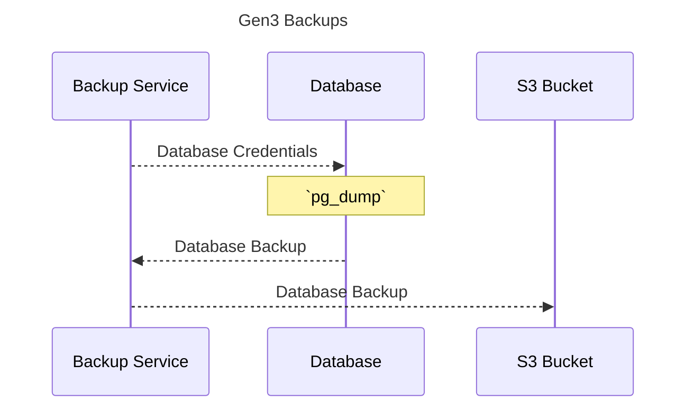

[![License: Apache 2.0][license-badge]][license]
[![GitHub Release][release-badge]][release]
[![Tests][tests-badge]][tests]
[![Docker][docker-badge]][docker]
[![Helm][helm-badge]][helm]

[license-badge]: https://img.shields.io/badge/License-Apache-blue.svg
[license]: https://opensource.org/license/apache-2-0

[release-badge]: https://img.shields.io/github/v/release/ACED-IDP/backup-service
[release]: https://github.com/ACED-IDP/backup-service/releases

[docker-badge]: https://img.shields.io/badge/Docker%20Repo-Quay.io-blue?logo=docker
[docker]: https://quay.io/repository/ohsu-comp-bio/backup-service?tab=tags&tag=latest

[helm-badge]: https://img.shields.io/badge/Helm-0F1689?logo=helm&logoColor=fff
[helm]: https://github.com/ohsu-comp-bio/helm-charts/tree/main/charts/backups

[tests-badge]: https://img.shields.io/github/actions/workflow/status/aced-idp/backup-service/tests.yaml?label=tests
[tests]: https://github.com/ACED-IDP/backup-service/actions/workflows/tests.yaml

# 1. Overview ⚙️

Data backup and recovery service for the CALYPR systems 🔄

# 2. Quick Start ⚡

```sh
➜ python3 -m venv venv && source venv/bin/activate

➜ pip install -e .

➜ backup --help
Usage: backup [OPTIONS]

Options:
  -H, --host TEXT      Postgres host ($PGHOST)  [required]
  -d, --database TEXT  Postgres database name ($PGDATABASE)  [required]
  -u, --user TEXT      Postgres username ($PGUSER)  [required]
  -p, --password TEXT  Postgres password ($PGPASSWORD)  [required]
  -o, --output TEXT    Output of database dump (e.g. s3://example-bucket/)
                       [required]
  -v, --verbose        Enable verbose output.
  --version            Show the version and exit.
  --help               Show this message and exit.
```

## Examples

> [!TIP]
> <details>
> <summary>Remote K8s Postgres to S3</summary>
> 
> ```sh
> ➜ kubectl config current-context
> kind-dev
> 
> ➜ kubectl get svc | grep postgresql
> local-postgresql
> 
> ➜ kubectl port-forward service/local-postgresql 5432:5432
> Forwarding from 127.0.0.1:5432 -> 5432
> Forwarding from [::1]:5432 -> 5432
> 
> ➜ export PGPASSWORD='example'
> 
> ➜ backup --host localhost:5432 --output s3://example-bucket/
> ```
> 
> </details>

# 3. Architecture 🛠️



# 4. Backups ↩️

| Service                | Postgres Database   | Database Backup Name          | Description                                      |
| ---------------------- | ------------------- | ----------------------------- | ------------------------------------------------ |
| [Arborist][arborist]   | `arborist-EXAMPLE`  | `arborist-EXAMPLE-TIMESTAMP`  | Gen3 policy engine                               |
| [Fence][fence]         | `fence-EXAMPLE`     | `fence-EXAMPLE-TIMESTAMP`     | AuthN/AuthZ OIDC service                         |
| [Gecko][gecko]         | `gecko-EXAMPLE`     | `gecko-EXAMPLE-TIMESTAMP`     | Frontend configurations for dynamic data loading |
| [Indexd][indexd]       | `indexd-EXAMPLE`    | `indexd-EXAMPLE-TIMESTAMP`    | Data indexing and tracking service               |
| [Requestor][requestor] | `requestor-EXAMPLE` | `requestor-EXAMPLE-TIMESTAMP` | Data access manager                              |

[arborist]: https://github.com/uc-cdis/arborist
[fence]: https://github.com/uc-cdis/fence
[gecko]: https://github.com/aced-idp/gecko
[indexd]: https://github.com/uc-cdis/indexd
[requestor]: https://github.com/uc-cdis/requestor

# 3. Additional Resources 📚

- [Gen3 Graph Data Flow](https://docs.gen3.org/gen3-resources/developer-guide/architecture/#gen3-graph-data-flow)

- [Data Submission System](https://gen3.org/resources/developer/#data-submission-system)

- [Gen3’s Microservices](https://gen3.org/resources/developer/microservice/)
