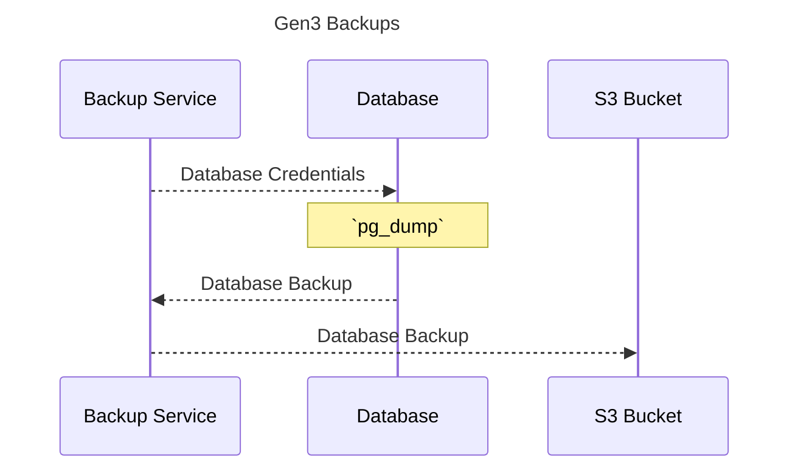

[![License: Apache 2.0][license-badge]][license]
[![GitHub Release][release-badge]][release]
[![Tests][tests-badge]][tests]
[![Docker][docker-badge]][docker]
[![Helm][helm-badge]][helm]

[license-badge]: https://img.shields.io/badge/License-Apache-blue.svg
[license]: https://opensource.org/license/apache-2-0

[release-badge]: https://img.shields.io/github/v/release/ACED-IDP/backup-service
[release]: https://github.com/ACED-IDP/backup-service/releases

[tests-badge]: https://img.shields.io/github/actions/workflow/status/aced-idp/backup-service/tests.yaml?label=tests
[tests]: https://github.com/ACED-IDP/backup-service/actions/workflows/tests.yaml

[docker-badge]: https://img.shields.io/badge/Docker%20Repo-Quay.io-blue?logo=docker
[docker]: https://quay.io/repository/ohsu-comp-bio/backup-service?tab=tags&tag=latest

[helm-badge]: https://img.shields.io/badge/Helm-0F1689?logo=helm&logoColor=fff
[helm]: https://github.com/ohsu-comp-bio/helm-charts/tree/main/charts/backups

# 1. Overview ⚙️

Data backup and recovery service for the CALYPR systems 🔄

# 2. Quick Start ⚡

```sh
➜ python3 -m venv venv && source venv/bin/activate

➜ pip install -e .

➜ bak --help
Usage: bak [OPTIONS] COMMAND [ARGS]...

Options:
  --version               Show the version and exit.
  -v, --verbose, --debug  Enable verbose (DEBUG) logging.
  --help                  Show this message and exit.

Commands:
  backup    Postgres ➜ S3
  download  S3 ➜ local
  dump      Postgres ➜ local
  ls        List databases
  restore   S3 ➜ Postgres
  upload    local ➜ S3
```

## Examples

| Example            | Notebook                               |
| ------------------ | -------------------------------------- |
| [Example][example] | [![Open in Colab][colab-badge]][colab] |

[example]: https://github.com/ga4gh/task-execution-schemas/releases/tag/v1.1
[colab-badge]: https://colab.research.google.com/assets/colab-badge.svg
[colab]: https://colab.research.google.com/github/ACED-IDP/backup-service/blob/main/examples/example.ipynb

> [!TIP]
>
> <details>
> <summary>Remote K8s Postgres to S3</summary>
>
> ```sh
> ➜ kubectl config current-context
> kind-dev
>
> ➜ kubectl get svc | grep postgresql
> local-postgresql
>
> ➜ kubectl port-forward service/local-postgresql 5432:5432
> Forwarding from 127.0.0.1:5432 -> 5432
> Forwarding from [::1]:5432 -> 5432
>
> ➜ export PGPASSWORD='example'
>
> ➜ backup --host localhost:5432 --bucket s3://example-bucket/
> ```
>
> </details>

# 3. Architecture 🛠️



# 4. Backups ↩️

| Service                | Postgres Database   | Database Backup Name          | Description                                      |
| ---------------------- | ------------------- | ----------------------------- | ------------------------------------------------ |
| [Arborist][arborist]   | `arborist-EXAMPLE`  | `arborist-EXAMPLE-TIMESTAMP`  | Gen3 policy engine                               |
| [Fence][fence]         | `fence-EXAMPLE`     | `fence-EXAMPLE-TIMESTAMP`     | AuthN/AuthZ OIDC service                         |
| [Gecko][gecko]         | `gecko-EXAMPLE`     | `gecko-EXAMPLE-TIMESTAMP`     | Frontend configurations for dynamic data loading |
| [Indexd][indexd]       | `indexd-EXAMPLE`    | `indexd-EXAMPLE-TIMESTAMP`    | Data indexing and tracking service               |
| [Requestor][requestor] | `requestor-EXAMPLE` | `requestor-EXAMPLE-TIMESTAMP` | Data access manager                              |

[arborist]: https://github.com/uc-cdis/arborist
[fence]: https://github.com/uc-cdis/fence
[gecko]: https://github.com/aced-idp/gecko
[indexd]: https://github.com/uc-cdis/indexd
[requestor]: https://github.com/uc-cdis/requestor

# 3. Design 📐

## User Story

As a data manager, I want to reliably back up PostgreSQL databases to S3-compatible storage and restore them when needed, ensuring data integrity and availability across different environments (local, cloud, or hybrid S3-compatible endpoints like MinIO or Ceph). This service should be easy to configure and automate.

### Acceptance Criteria + Testing

#### Database Dump:

- [ ] The service can connect to a PostgreSQL instance using provided credentials.
- [ ] It can list all non-template databases within the PostgreSQL instance.
- [ ] It can successfully create a compressed dump (`.sql` file) for each specified database into a local directory.
- [ ] Each dump file is named appropriately, incorporating a timestamp for unique identification.
- [ ] Error handling is in place for failed database connections or dump operations.

```sh
# Ensure PGPASSWORD environment variable is set or password is provided securely
# Example for a local Postgres and MinIO/Ceph
export PGPASSWORD='your_postgres_password'

bak backup \
  --host localhost \
  --port 5432 \
  --user postgres \
  --password "$PGPASSWORD" \
  --dir /tmp/db_dumps \
  --endpoint https://aced-storage.ohsu.edu \
  --bucket backup-tests \
  --key your_s3_access_key \
  --secret your_s3_secret_key
```

#### S3 Upload:

- [ ] The service can connect to an S3-compatible endpoint (e.g., MinIO, Ceph, AWS S3) using provided credentials and endpoint URL.
- [ ] It can successfully upload the generated database dump files to the specified S3 bucket.
- [ ] The upload operation handles files of various sizes.
- [ ] The upload mechanism is configured to avoid common S3-compatibility issues, such as checksum mismatches, when interacting with non-AWS S3 targets by disabling client-side checksum generation where possible.
- [ ] Error handling is in place for failed S3 connection or upload operations.

```sh
bak upload \
  --dir /path/to/local/dumps \
  --endpoint https://aced-storage.ohsu.edu \
  --bucket backup-tests \
  --key your_s3_access_key \
  --secret your_s3_secret_key
```

#### S3 Download:

- [ ] The service can connect to the S3-compatible endpoint and list objects within the specified bucket.
- [ ] It can successfully download objects (database dumps) from the S3 bucket to a local directory.
- [ ] Error handling is in place for failed S3 connection or download operations.

```sh
bak download \
  --dir /tmp/downloaded_dumps \
  --endpoint https://aced-storage.ohsu.edu \
  --bucket backup-tests \
  --key your_s3_access_key \
  --secret your_s3_secret_key
```

#### Database Restore:

- [ ] The service can successfully restore a database from a locally available dump file using `pg_restore`.
- [ ] The restore operation can target an existing database.
- [ ] Error handling is in place for failed restore operations.

```sh
# Assuming /tmp/downloaded_dumps/your_database.sql exists
export PGPASSWORD='your_postgres_password'

bak restore \
  --host localhost \
  --port 5432 \
  --user postgres \
  --password "$PGPASSWORD" \
  --dir /tmp/downloaded_dumps # The directory where the dump file is
```

# 4. Alternatives 📖

- [velero](https://velero.io)

# 5. Additional Resources 📚

- [Gen3 Graph Data Flow](https://docs.gen3.org/gen3-resources/developer-guide/architecture/#gen3-graph-data-flow)

- [Data Submission System](https://gen3.org/resources/developer/#data-submission-system)

- [Gen3’s Microservices](https://gen3.org/resources/developer/microservice/)

- [**AWS**: PostgreSQL pg_dump and pg_restore utility](https://docs.aws.amazon.com/dms/latest/sbs/chap-manageddatabases.postgresql-rds-postgresql-full-load-pd_dump.html)

- [**Postgres**: pg_dump](https://www.postgresql.org/docs/current/app-pgdump.html)

- [**Postgres**: pg_restore](https://www.postgresql.org/docs/current/app-pgrestore.html)
